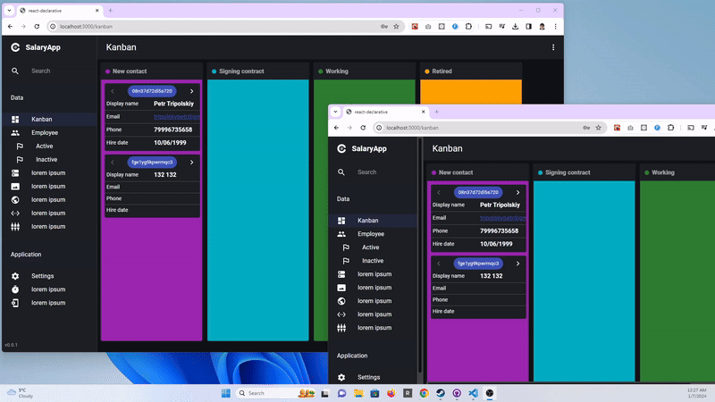
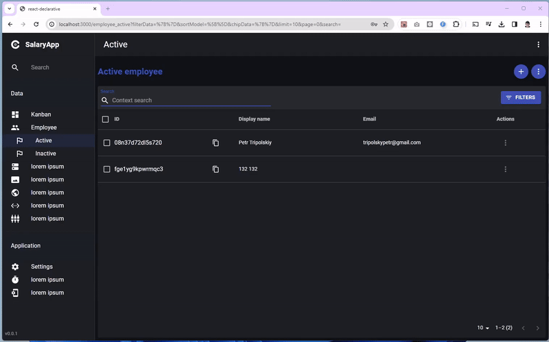
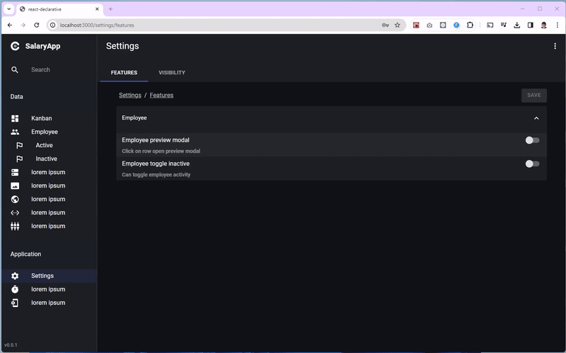

# ⚛️ react-salary-app

> The most advanced starter kit for CRM system build with [Pocketbase](https://pocketbase.io/). It includes Kanban board, JSON form layout engine, feature model support, field visibility flags, grid component with fulltext search and modal filters.

Pocketbase is extremely fast application server. That software uses `cznic/sqlite` to embed sqlite3 into binary without database connection drivers. The `cznic/sqlite` is a golang port of `mattn/go-sqlite3` (CGO-free, no C-language FFI). That means, all data traffic exist in a single assembly, maybe in a future we will see [esbuild-like](https://esbuild.github.io/) benchmark

Also, for some tasks making a full backup of your data is much easier when you got single `data.db` file. In that case, the starter kit for the next app development will be quite usefull

## Kanban Board

> The low-code kanban board with single `useState` call and realtime updates support

([Source code](./src/pages/view/KanbanPage))

## Data grid and JSON template engine

> The preview modal and the full page uses the same json schema so no extra code required

([Source code](./src/pages/view/EmployeePage))

## Feature model and dynamic field visibility

> The subset of fields can be hidden from settings. The behaviour of buttons can be changed by using feature flags

([Source code](./src/pages/view/SettingsPage))

